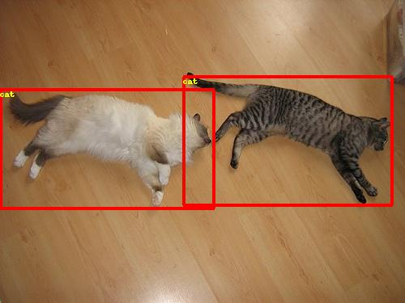
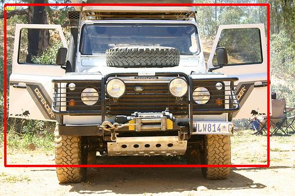

# 1. Problem
This benchmark uses [Single Shot MultiBox Detector (SSD)](https://arxiv.org/abs/1512.02325) to detect objects in images.


<p align="center">

 <br />
MobileNet-v1-SSD 300x300 Visualization Examples
</p>

# 2. Directions
### Steps to set up the Paddle environment
We provided PaddlePaddle v0.14.0 as a submodule so that users can compile PaddlePaddle from source. But since compiling takes quite some time (can take 1hr+ depending on the machine), we recommend using Docker image, which has a pre-compiled and stable PaddlePaddle environment.

A docker image can be pulled using:
```
docker pull paddlepaddle/paddle:0.14.0
```

To run the docker container, use:
```
nvidia-docker run -it -v `pwd`:/paddle -e CUDA_VISIBLE_DEVICES=0,1 paddlepaddle/paddle:0.14.0 /bin/bash
```

### Steps to download and verify data
PaddlePaddle's model library has a complete instruction on how to get the data, train, evaluate and infer [here](https://github.com/PaddlePaddle/models/blob/develop/fluid/object_detection/README.md)

You can use [PASCAL VOC dataset](http://host.robots.ox.ac.uk/pascal/VOC/) or [MS-COCO dataset](http://cocodataset.org/#download).

Inside the Docker container, you can git clone PaddlePaddle's model library and run the download script
```
cd /paddle
source env.sh
git clone https://github.com/PaddlePaddle/models.git
cd models/fluid/object_detection/
cd data/pascalvoc
./download.sh
cd ../..
```


### Steps to run and time

#### Run and Time

Run the bash script to get the model and run:
```
cd pretrained/
wget http://paddlemodels.bj.bcebos.com/ssd_mobilenet_v1_pascalvoc.tar.gz
tar -xf ssd_mobilenet_v1_pascalvoc.tar.gz
cd ..
python -u train.py --batch_size=64 --dataset='pascalvoc' --num_passes=120 --pretrained_model='pretrained/ssd_mobilenet_v1_pascalvoc/'
```

Training stops after 120 epochs.

# 3. Dataset/Environment
### Publication/Attribution
[PASCAL VOC dataset](http://host.robots.ox.ac.uk/pascal/VOC/) and [MS-COCO dataset](http://cocodataset.org/#download)
All images will be resized to 300x300. In training stage, images are randomly distorted, expanded, cropped and flipped.

# 4. Model
### Publication/Attribution
```
    SSD: Single Shot MultiBox Detector:
        @inproceedings{liu2016ssd,
        title = {{SSD}: Single Shot MultiBox Detector},
        author = {Liu, Wei and Anguelov, Dragomir and Erhan, Dumitru and Szegedy, Christian and Reed, Scott and Fu, Cheng-Yang and Berg, Alexander C.},
        booktitle = {ECCV},
        year = {2016}
    }
```

### List of layers
six levels predictions are made in six different scale feature maps. And there are two 3x3 convolutional layers in each feature map, which predict category or a shape offset relative to the prior box(also called anchor), respectively. Thus, we get 38x38x4 + 19x19x6 + 10x10x6 + 5x5x6 + 3x3x4 + 1x1x4 = 8732 detections per class.
<p align="center">
<br />
The Single Shot MultiBox Detector (SSD)
</p>
### Weight and bias initialization
Weights are initialized using Xavier initialization method and biases are initialized to zero.
### Loss function
ssd_loss function is used for computing the loss.
### Optimizer
RMSProp is used for optimization.
# 5. Quality
### Quality metric
Average accuracy for all samples in the test set.
### Quality target
After 120 epochs we achieve 73.32% mAP under 11point metric.
### Evaluation frequency
All test samples are evaluated once per epoch.
### Evaluation thoroughness
All test samples are evaluated once per epoch.