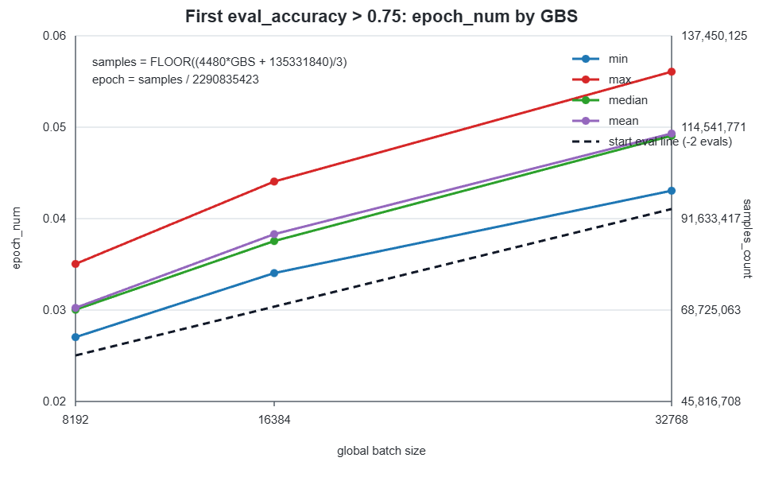

# Recommendation v4 — HSTU sequential recommendation (Yambda-5b)

MLPerf Training reference benchmark. This is a fork of
[meta-recsys/generative-recommenders](https://github.com/meta-recsys/generative-recommenders)
extended to train an HSTU (Hierarchical Sequential Transduction Units) ranking
model on the [Yambda-5b](https://huggingface.co/datasets/yandex/yambda)
music-recommendation dataset, sized as an MLPerf-style training benchmark inside
the `mlcommons/training` tree.

# 1. Problem

This benchmark trains a model that predicts what a person will listen to next.
Given the history of songs a user has played, liked, or skipped, the model
learns to rank which song the user is most likely to genuinely listen to (rather
than skip) next. This is the same kind of "what should we recommend next?"
problem that powers music and video streaming feeds. The model is trained on a
large public dataset of anonymized music-listening events and is scored on how
well it predicts future listens it has never seen.

Technically, the model is a **sequential recommender**: instead of treating each
interaction independently (as classic click-through-rate models like DLRM-DCNv2
do), it consumes a user's chronologically ordered interaction history as a
sequence and applies a Transformer-style attention stack (HSTU) over it. Each
training example is one "anchor" listen event together with that user's prior
history (user interaction history, or UIH) and a set of contextual/cross
features. The supervised target is a binary `listen_plus` label (a real listen:
played for at least 50% of the track) versus a skip.

Training is **streaming / temporal-order**: the timeline is sliced into
fixed-duration windows and the model trains on window `T` then evaluates on the
strictly-future window `T+1`, so every reported metric is genuine
next-period generalization with no future leakage. The quality metric is
**AUC** on the held-out future window, and the convergence target is
**AUC >= 0.75**.

The reference runs on 8 GPUs (validated on AMD Instinct MI350X / MI355X and
NVIDIA B200; see [docs/training_recipe.md](docs/training_recipe.md)) and scales
to multi-node via SLURM.

# 2. Directions

The benchmark follows the standard MLPerf reference script flow.

### Steps to configure machine

Build and enter the container, which is the canonical frozen environment
(torch 2.10 / fbgemm / torchrec 1.4.0 / triton 3.6):

```bash
docker build -t recommendation_v4 .
docker run --rm -it --device=/dev/kfd --device=/dev/dri \
    -v /path/to/dlrm_data:/data/mlperf_dlrm_v4 recommendation_v4
```

Full environment pinning, kernel selection and per-platform notes are in
[docs/training_recipe.md](docs/training_recipe.md).

### Steps to download and verify data

There are two ways to get the data. Option A downloads a ready-to-train copy
from MLCommons. Option B builds it from the upstream HuggingFace release. Both
end at a tree the trainer accepts, but they deliver different files:

```
$DLRM_DATA_PATH/                                          A       B
├── processed_5b/
│   ├── hstu_cache_L4086/            227.24 GB       download  built on 1st run
│   ├── item_popularity.npy              75 MB       download  preprocessing
│   ├── train_sessions.parquet        46.79 GB          --     preprocessing
│   ├── session_index.parquet           600 MB          --     preprocessing
│   ├── test_events.parquet             152 MB          --     preprocessing
│   └── split_meta.json                  361 B          --     preprocessing
└── shared_metadata/
    ├── album_item_mapping.parquet     54.5 MB       download  download
    └── artist_item_mapping.parquet    38.3 MB       download  download
```

The trainer opens only `hstu_cache_L4086/` and the two mappings.
`item_popularity.npy` is read solely to cross-check the vocabulary size against
the mappings. Option A therefore ships no parquet: `train_sessions.parquet` is
the input the cache is built from, and the other three files are preprocessing
outputs nothing reads.

#### Option A — download the prepared dataset

227.41 GB, ready to train with no preprocessing and no cache build. Needs
[rclone](https://rclone.org/downloads/); the endpoint and credentials are
published with the submission package.

```bash
export DLRM_DATA_PATH=/data/mlperf_dlrm_v4
rclone config create mlperf-dlrmv4 s3 provider=Cloudflare \
    access_key_id=<KEY> secret_access_key=<SECRET> \
    endpoint=<ENDPOINT> no_check_bucket=true

rclone copy --progress mlperf-dlrmv4:<BUCKET>/dlrm_v4_yambda_5b "$DLRM_DATA_PATH"
```

Verify:

```bash
DLRM_DATA_PATH=/data/mlperf_dlrm_v4 ./verify_dataset.sh
```

This is the same script Option B uses; it detects which layout is present and
checks what it finds. For Option A that is the two mappings and
`item_popularity.npy` against
[`md5sums_yambda_5b_processed.txt`](md5sums_yambda_5b_processed.txt), and the
sixteen cache files against
[`sha256sums_yambda_5b_cache.txt`](sha256sums_yambda_5b_cache.txt).

Most of the transfer buys you a cache build that needs ~190 GB of RAM, which is
the binding constraint on smaller hosts. If you would rather build it, take
Option B — the cache is fully derived from `train_sessions.parquet`, and the two
routes converge on byte-identical files (see below).

#### Option B — build from the upstream HuggingFace release

```bash
# download raw + preprocess (~53 min for 5b, ~2 min for 50m)
DLRM_DATA_PATH=/data/mlperf_dlrm_v4 ./download_dataset.sh

# verify the preprocessed files
DLRM_DATA_PATH=/data/mlperf_dlrm_v4 ./verify_dataset.sh
```

- [`download_dataset.sh`](download_dataset.sh) wraps the preprocessing pipeline
  in `generative_recommenders.dlrm_v4.preprocess_public_data` (HuggingFace
  download + temporal split + session segmentation + item-popularity counts).
  The pipeline itself is described in
  [§3 Data preprocessing](#data-preprocessing). It pulls 38.3 GB from the
  `yandex/yambda` repository — `flat/5b/multi_event.parquet` plus the two item
  mappings — not the full 195 GB repository.
- [`verify_dataset.sh`](verify_dataset.sh) checks the preprocessed files against
  [`md5sums_yambda_5b_processed.txt`](md5sums_yambda_5b_processed.txt). Those
  hash byte-for-byte artifacts, so they verify a copy or a download; re-running
  preprocessing elsewhere can produce logically identical parquet files with
  different bytes.
- The flat-event cache is built on the first training run, not here. Re-run
  `verify_dataset.sh` afterwards and it will additionally check the cache
  against [`sha256sums_yambda_5b_cache.txt`](sha256sums_yambda_5b_cache.txt).
  That works because the build is deterministic: sessions are sorted by
  `(uid, session_id)`, which is a total order, and `.npy` records only dtype and
  shape, so nothing run-specific reaches the bytes. Rebuilding from the same
  `train_sessions.parquet` on a different host reproduces all sixteen files
  byte-for-byte, so a locally built cache verifies against the same hashes as
  the Option A download.

Budget ~313 GB of disk for the peak (raw + preprocessed + cache) and a host with
~190 GB of RAM for the cache build. Deleting `raw/` after preprocessing brings
the steady state to ~275 GB.

For smaller variants (`yambda-50m` / `yambda-500m`) substitute the dataset name
(`DATASET=yambda-50m ./download_dataset.sh`).

### Steps to run and time

```bash
DLRM_DATA_PATH=/data/mlperf_dlrm_v4 ./run_and_time.sh
```

[`run_and_time.sh`](run_and_time.sh) runs the full-reference streaming
train+eval sweep on a single 8-GPU host with `AUC_THRESHOLD=0.75` and MLPerf
compliance logging, printing the elapsed time of the timed region.

### Multi-node (SLURM)

For N >= 1 nodes use [`scripts/launch_slurm.sh`](scripts/launch_slurm.sh), which
provisions the container on each node and launches the same trainer. A bare
submit runs a small functional smoke run; set the run-shape knobs for the full
sweep:

```bash
# smoke (fast functional check)
sbatch --nodes=1 scripts/launch_slurm.sh

# full reference sweep
START_TS=0 NUM_TRAIN_TS=299 \
NUM_TRAIN_BATCHES=0 NUM_EVAL_BATCHES=0 \
EVAL_EVERY_N_WINDOWS=0 EVAL_EVERY_DATA_PCT=0.001 \
AUC_THRESHOLD=0.75 \
sbatch --nodes=2 scripts/launch_slurm.sh
```

Multi-node uses real RDMA (RoCEv2); the fabric/NCCL setup is documented in
[docs/multi_node_config.md](docs/multi_node_config.md). Keep all run outputs
(log, checkpoints, mllog, TensorBoard) under a writable scratch path you own —
the dataset mount is read-only.

### Checkpointing and resume

The streaming loop is resume-aware: set `CKPT_PATH` to enable DMP checkpoint
save/load (auto-resolves to the highest-numbered subdir), with retention via
`KEEP_LAST_N` and cadences `IN_WINDOW_CKPT_FREQ` / `CKPT_STEP_FREQ` /
`CKPT_TIME_INTERVAL_S`. The MLPerf run state (run-started flag, global sample
count) is persisted across resume so compliance logging is continuous. See
`generative_recommenders/dlrm_v4/checkpoint.py`.

# 3. Dataset/Environment

### Publication/Attribution

[Yambda-5b](https://huggingface.co/datasets/yandex/yambda) is a public
anonymized music-recommendation dataset released by Yandex from the
Yandex.Music streaming platform. Cite:

> Yambda-5B — A Large-Scale Multi-modal Dataset for Ranking And Retrieval.
> [arXiv:2505.22238](https://arxiv.org/abs/2505.22238).

The dataset is distributed on HuggingFace at
[`yandex/yambda`](https://huggingface.co/datasets/yandex/yambda) under that
repository's stated terms. The `5b` variant is used for the reference; `500m`
and `50m` variants exist for smaller-scale experimentation. Yandex's own
evaluation protocol is based on a Global Temporal Split, which this benchmark
also uses (see [Training and test data separation](#training-and-test-data-separation)).

### Data preprocessing

Statistics after preprocessing:

| | |
|---|---|
| Total interaction events | **4.76 B** |
| Unique users | **1.00 M** |
| Max events per user | 27,738 |
| Median events per user | 2,695 |
| Mean events per user | 4,763 |
| Train events (300d) | 4.76 B |
| Test events (1d) | 22.4 M |
| Item catalog size | 9.39 M |

Per-event-type distribution across the full 4.76 B corpus:

| Pool | Definition | Count | Share |
|---|---|---|---|
| **listen_plus (lp)** | `is_listen AND played_ratio >= 50%` | 2.92 B | **61.3%** |
| **skip** | `is_listen AND played_ratio < 50%` | 1.71 B | **35.9%** |
| **like** | explicit thumbs-up action | 89 M | **1.9%** |
| other | dislike / unlike / undislike | 47 M | 1.0% |

The `like` pool is roughly **30x rarer** than `lp` — important context for the
per-pool gather strategy below.

**Pipeline.** `./download_dataset.sh` (which calls
`python3 -m generative_recommenders.dlrm_v4.preprocess_public_data --dataset
yambda-5b --data-path <root>`) downloads the 5b variant from HuggingFace, then:

1. **Encodes** the raw `event_type` string into a uint8 lookup (listen=0,
   like=1, dislike=2, unlike=3, undislike=4).
2. **Splits** events temporally — 300 train days, 30-min gap, 1 test day — by
   Global Temporal Split (GTS).
3. **Segments** per-user event timelines into sessions on a 30-min inactivity
   gap.
4. **Computes** per-item popularity for downstream metric weighting.
5. **Writes** the layout `DLRMv4YambdaDataset` expects:

```
<data-path>/
├── raw/5b/multi_event.parquet                    50 GB (downloaded)
├── shared_metadata/
│   ├── artist_item_mapping.parquet               60 MB
│   ├── album_item_mapping.parquet                76 MB
│   └── embeddings.parquet                         18 GB (unused by HSTU training)
└── processed_5b/
    ├── train_sessions.parquet                     47 GB  ← main training input
    ├── test_events.parquet                       152 MB
    ├── session_index.parquet                     600 MB
    ├── item_popularity.npy                        75 MB
    └── split_meta.json                            anchor + boundary stats
```

**Feature construction (how data is fed to HSTU).** For every training anchor (a
LISTEN event with >= `min_history` prior events), the dataset builds a
`(uih_kjt, candidate_kjt)` pair:

```
UIH (User Interaction History):
  ┌─ Sequence features (chronologically interleaved across 3 pools)
  │    item_id, artist_id, album_id            ← per-position
  │    action_weight                            ← per-position (LP_BIT/LIKE_BIT/SKIP_BIT)
  │    action_timestamp, dummy_watch_time      ← per-position
  └─ Contextual features (length 1 each)
       uid + 7 cross-feature hashes (user_x_artist, item_x_hour, …)
                                                = 8 contextual entries

CANDIDATE (the LISTEN event at the anchor):
  item_id, artist_id, album_id, item_query_time,
  item_action_weight (LP_BIT if listen_plus, else 0),
  item_dummy_watchtime
```

The candidate's `action_weight` is **the supervision label**: HSTU's
`_get_supervision_labels_and_weights` masks BCE training to
`(supervision_bitmask & task_weight) > 0`, with `task_weight = 1` (LP bit) for
the single `listen_plus` task — so only listen_plus candidates supervise (see
[§4 Loss function](#loss-function)).

**Per-pool gather (the cap = L // 3 strategy).** The UIH is built by
`DLRMv4YambdaDataset._gather_interleaved_history`. For each anchor it:

1. Scans the most recent `scan_window` (default 20,000) events of any type
   before the anchor, **clipped to user_start**.
2. From those, takes **the last `L // 3` events** from each of the three pools
   (lp, like, skip) independently.
3. Concatenates and **re-sorts chronologically** to produce an interleaved
   sequence.
4. Tags each event's pool identity into `action_weight` via OR'd bitmask
   (LP=1, LIKE=2, SKIP=4).

With `history_length = 4086` and `max_seq_len = 4096`: per-pool cap = `4086 //
3 = 1362`, and `3 × 1362 + 8 contextual + 1 candidate = 4095 <= 4096` (no
truncation). Because the `like` pool is rare (1.9%) it under-fills (~105 events
per anchor on average); the Triton jagged-attention backend skips unfilled
slots, so the under-fill costs sequence budget but not GPU compute.

### Training and test data separation

Separation happens at two levels, one in preprocessing and one in the training
loop.

**Preprocessing (GTS).** Step 2 of the pipeline above carves the corpus by wall
clock into 300 training days, a 30-minute gap, and a final 1 test day (22.4 M
events). This is the dataset's own Global Temporal Split.

**Training loop (streaming holdout).** Within the training portion, the
benchmark holds out a future window rather than a random user subset. The
evaluation set is a fixed held-out future window (`eval_holdout_ts`, default
`start_ts + num_train_ts`); with `TRAIN_SPLIT_PERCENTAGE < 1.0` the held-out
users' anchors over that window form the eval set. Because evaluation is always
one window ahead of training, reported AUC is genuine next-period
generalization.

The streaming path enforces **no future leakage** at two levels:

1. **Across windows** — a window is the set of anchors whose target/candidate
   timestamp falls in `[t_min + T·W, t_min + (T+1)·W)`. Training only ever sees
   windows `<= T`; the evaluation window `T+1` is strictly in the future of every
   training anchor it is scored against.
2. **Within an anchor** — history is gathered **causally**: the UIH scan is
   `scan_start:flat_pos` (events strictly before the anchor), so no event at or
   after the anchor's timestamp can enter its features.

Windows are indexed off the per-anchor target timestamp via a lazily-built,
mmap'd `anchor_ts` cache keyed by `(history_length, min_history)`.

### Training data order

The training data is traversed in **strict wall-clock order**, not shuffled.
`scripts/launch_slurm.sh` and `run_and_time.sh` default to
`--mode streaming-train-eval`: the timeline is sliced into fixed-duration
**windows** (default 1 day, `get_dataset.streaming_window_seconds = 86400`), and
the loop walks them forward:

```
window T:    train          window T+1:  eval (then train)   window T+2: eval (then train) ...
   └─ train window T ─┐
                      └─ eval window T+1 ─┐
                                          └─ train window T+1 ─┐
                                                               └─ eval window T+2 ...
```

i.e. for each step it **trains window T, then evaluates window T+1** before
advancing — always predicting the immediate future from the past. Within a
window, anchors are consumed in dataset order; an optional partial shuffle
(`STREAMING_SHUFFLE_FRACTION`, default `0.0` = off) can perturb intra-window
order without crossing window boundaries.

Streaming knobs, all configurable via
[`yambda_5b.gin`](generative_recommenders/dlrm_v4/train/gin/yambda_5b.gin) with
env overrides:

| env | gin | default | meaning |
|---|---|---|---|
| `START_TS` | `streaming_train_eval_loop.start_ts` | 150 | first window (early windows are near-empty warm-up) |
| `NUM_TRAIN_TS` | `streaming_train_eval_loop.num_train_ts` | 149 | number of train windows (clamped to available) |
| `PERSISTENT_LOADER` | `streaming_train_eval_loop.persistent_loader` | 1 | reuse one worker pool across windows |
| `DOUBLE_BUFFER` | `streaming_train_eval_loop.double_buffer` | 1 | prepare the next window in a background thread |
| `EVAL_EVERY_N_WINDOWS` | `streaming_train_eval_loop.eval_every_n_windows` | 1 | eval cadence by window count (0 to use data-pct) |
| `EVAL_EVERY_DATA_PCT` | `streaming_train_eval_loop.eval_every_data_pct` | 0.0 | eval cadence by fraction of train data (full ref / RCP: 0.001) |
| `MIN_HISTORY` | `get_dataset.min_history` | 4086 | anchor-eligibility floor (0 = ~all users incl. cold-start) |

### Test data order

The evaluation window is traversed once per evaluation, in the same in-window
dataset order, with no shuffling. Every eval pass scores the entire holdout
window, so the test order does not affect the reported AUC.

# 4. Model

### Publication/Attribution

The model is **HSTU** (Hierarchical Sequential Transduction Units), the
generative-recommender architecture from Meta's ICML'24 paper *Actions Speak
Louder than Words: Trillion-Parameter Sequential Transducers for Generative
Recommendations* ([arXiv:2402.17152](https://arxiv.org/abs/2402.17152)).

The implementation is a fork of
[meta-recsys/generative-recommenders](https://github.com/meta-recsys/generative-recommenders);
see the upstream README for the original modeling code. The exact architecture
and table specs for this benchmark live in
`generative_recommenders/dlrm_v4/configs.py` (`get_hstu_configs`,
`get_embedding_table_config`).

### List of layers

HSTU replaces the feature-interaction stack of a classic DLRM with a stack of
pointwise-attention "transducer" layers operating over the user's interaction
sequence. In the `dlrm_v4` yambda path the forward pass is:

**1. `EmbeddingCollection`** — sparse lookup, sharded across GPUs with TorchRec
`DistributedModelParallel`. All tables are `embedding_dim = 512`, FP32:

| Table | `num_embeddings` |
|---|---|
| `item_id` | 9,390,624 |
| `artist_id` | 1,293,395 |
| `album_id` | 3,367,692 |
| `uid` | 1,000,001 |
| `user_x_artist` | 100,000,000 |
| `user_x_album` | 40,000,000 |
| `user_x_hour` | 24,000,000 |
| `item_x_hour` | 40,000,000 |
| `artist_x_hour` | 32,000,000 |
| `user_x_is_organic` | 2,000,000 |
| `user_x_artist_x_hour` | 40,000,000 |

**2. User path — `HSTUTransducer`**, over the merged UIH + candidate sequence:

- `ContextualPreprocessor` — batched linear over the 8 contextual entries (uid +
  7 cross hashes), a content MLP on the post-id embedding, and an action encoder
  over the `action_weight` bits `[1, 2, 4]` (action embedding dim 8); the
  branches are summed. Hidden dim 256, output dim 512.
- `HSTUPositionalEncoder` — position (8192 buckets) and time (2048 buckets)
  embeddings added to the sequence.
- Input dropout, ratio 0.2.
- `STUStack` of **3** `STULayer` (`HSTU_NUM_LAYERS`, default 3): embedding dim
  512, 4 heads, hidden (U/V) dim 128, attention (Q/K) dim 128, causal
  target-aware attention with a fused jagged-attention Triton kernel in bf16.
  HSTU fuses attention and FFN into one UVQK projection plus SiLU gating, so
  there is no separate feed-forward block. Linear dropout 0.1.
- `TimestampLayerNormPostprocessor` — appends cyclical time features
  (hour-of-day, day-of-week) and applies `Linear(516 -> 512) -> LayerNorm`.

**3. Item path — `_item_embedding_mlp`**: concatenate the candidate's
`item_id`, `artist_id`, `album_id` embeddings (3 x 512 = 1536), then
`Linear(1536 -> 512) -> SwishLayerNorm(512) -> Linear(512 -> 512) -> LayerNorm(512)`.

**4. Prediction head — `DefaultMultitaskModule`**: takes the element-wise
product of the user and item embeddings (512-d) through
`Linear(512 -> 512) -> SwishLayerNorm(512) -> Linear(512 -> 1)`, emitting raw
logits for the single `listen_plus` task.

### Weight and bias initialization

**Embedding tables.** Each table gets a seeded uniform init in
`uniform(-1/sqrt(N), +1/sqrt(N))` where `N = num_embeddings`, matching
TorchRec's default bounds (`_uniform_init_bounds` in `configs.py`). The
generator seed for each table is `sha256(f"{init_seed}:{table_name}")` rather
than Python's salted `hash()`, so a given `$SEED` produces identical tables on
every rank and every run (`_stable_table_seed` / `_make_seeded_uniform_init`).
Because TorchRec first builds the collection on the meta device, the fused TBE
path materializes real storage later under `DistributedModelParallel`; the
trainer re-seeds `torch.manual_seed` / `torch.cuda.manual_seed_all` immediately
before that step so sharded table init is reproducible too
(`train/utils.py`, `make_optimizer_and_shard`).

**Dense layers.** All MLPs (item MLP, preprocessor MLPs, postprocessor combiner,
prediction head) use `init_mlp_weights_optional_bias` in
`generative_recommenders/common.py`: `xavier_uniform_` on `Linear` weights and
zero-filled biases.

**HSTU attention (`STULayer`).** The fused UVQK projection weight and the output
weight are `xavier_uniform_`; the UVQK beta is zeros; the input and output norm
weights are ones with zero biases. Remaining non-STU `Linear` layers inside
`HSTUTransducer` are `xavier_normal_`.

**Other.** Action embeddings are `normal_(0, action_embedding_init_std)` with
std 0.1; the positional encoder is uniform in `[-sqrt(1/buckets),
+sqrt(1/buckets)]`; `SwishLayerNorm` weights are ones and biases zeros.

**Seeding.** `seed_everything(SEED)` (default `SEED=1`) seeds Python, NumPy and
torch (CPU and CUDA) with the same value on every rank before the model is
built, so dense init is rank-identical. After init, `decorrelate_runtime_rng()`
re-seeds with `SEED + rank` so dropout differs per rank; this does not affect
weight init.

### Loss function

**Masked binary cross-entropy with logits.** For the single `listen_plus` binary
task, labels come from the candidate's supervision bitmask,
`(supervision_bitmask & task_weight) > 0` with `task_weight = 1`
(`_get_supervision_labels_and_weights` in `modules/dlrm_hstu.py`); per-sample
weights default to all ones.

`_compute_loss` in `modules/multitask_module.py` computes
`F.binary_cross_entropy_with_logits(..., reduction="none")` per position, then
reduces along the sequence as `sum(-1) / weights.sum(-1).clamp(min=1.0)` and
scales by `causal_multitask_weights = 0.2`. Per-task scalars are summed to form
the training loss; with one task the total loss is that single scaled term. The
head emits raw logits (no sigmoid); sigmoid is applied only for inference
predictions.

### Optimizer

Two optimizers, configured in
[`yambda_5b.gin`](generative_recommenders/dlrm_v4/train/gin/yambda_5b.gin):

| component | optimizer | gin binding | key settings |
|---|---|---|---|
| Dense params (HSTU blocks, MLPs) | **Adam** | `dense_optimizer_factory_and_class.*` | lr `DENSE_LR`, betas (0.95, 0.999), eps 1e-8, weight_decay 0 |
| Sparse embedding tables | **RowWiseAdagrad** (fused FBGEMM TBE) | `sparse_optimizer_factory_and_class.*` | lr `SPARSE_LR`, eps 1e-8, weight_decay 0 |

Gradient clipping (`GRAD_CLIP_NORM`, default `max_norm=1.0`) is applied to the
dense parameters on the streaming path; the fused sparse optimizer is
unaffected.

### Precision

Training is **bf16 mixed precision** (`make_model.bf16_training=True`), with the
HSTU attention computed by a fused jagged-attention Triton kernel in bf16. The
sparse embedding all-to-all defaults to fp32 in both directions
(`SPARSE_A2A_FWD` / `SPARSE_A2A_BWD`) and can be lowered to bf16/fp16.

### Hyperparameters

Hyperparameters live in
[`yambda_5b.gin`](generative_recommenders/dlrm_v4/train/gin/yambda_5b.gin)
(the config-file source of truth) and are **overridable via environment
variables** (the env value takes precedence over the gin default, per MLPerf
CONTRIBUTING rule 4d). The gin macros (`@env_int`, `@env_float`, `@env_str`)
enforce the correct type for each parameter.

The main ones:

| hyperparameter | env var | gin binding | default |
|---|---|---|---|
| Per-rank batch size | `BATCH_SIZE` | `batch_size` | 1024 |
| Dense learning rate | `DENSE_LR` | `dense_optimizer_factory_and_class.learning_rate` | 1e-7 |
| Sparse learning rate | `SPARSE_LR` | `sparse_optimizer_factory_and_class.learning_rate` | 1e-7 |
| LR warmup steps | `LR_WARMUP_STEPS` | `streaming_train_eval_loop.lr_warmup_steps` | 24000 |
| LR the warmup ramps from | `LR_WARMUP_START_LR` | `streaming_train_eval_loop.lr_warmup_start_lr` | 0.0 |
| Grad clip max-norm | `GRAD_CLIP_NORM` | `streaming_train_eval_loop.grad_clip_norm` | 1.0 (0 disables) |
| HSTU attention layers | `HSTU_NUM_LAYERS` | `get_hstu_configs.hstu_attn_num_layers` | 3 |
| UIH history length | `HISTORY_LENGTH` | `get_dataset.history_length` | 4086 |
| Max sequence length | `MAX_SEQ_LEN` | `get_hstu_configs.max_seq_len` | 4096 |
| RNG seed | `SEED` | `seed_everything.seed` | 1 (-1 = random per run) |

`BATCH_SIZE` is per rank, so the global batch size is `BATCH_SIZE × world_size`;
the RCP sweep's 8192 / 16384 / 32768 points are this default at world sizes 8 /
16 / 32. `DENSE_LR` and `SPARSE_LR` set the **base** LR, which is the value the
warmup ramps up to and then holds — the warmup schedule never overrides them.
`LR_WARMUP_START_LR` is the LR at global step 0; the ramp is
`start + (base - start) * min(1, gstep / LR_WARMUP_STEPS)`, keyed off the
checkpoint-restored global step so it survives a resume unchanged.

Everything the closed division fixes is emitted to the MLLog stream at
`RUN_START`, read from the same gin bindings the model itself resolves, so the
log cannot drift from the config: the Adam betas, epsilon and weight decay, the
grad clip norm, both warmup knobs, both optimizer names and base LRs, the max
sequence length, and the eval cadence. The closed rules pin each one, which is
what makes "fixed" enforceable rather than merely documented — a value that is
never logged can never be checked.

Streaming and windowing knobs (`START_TS`, `NUM_TRAIN_TS`, `MIN_HISTORY`, the
eval cadence) are listed under
[Training data order](#training-data-order); the sparse all-to-all precision
knobs are under [Precision](#precision). Values that are not exposed as
environment variables — optimizer betas (0.95, 0.999), eps 1e-8, weight decay 0,
the 86400 s streaming window — are pinned directly in the gin file.

# 5. Quality

### Quality metric

**AUC** on the held-out future evaluation window (`window_auc` for the
`listen_plus` task), computed by `MetricsLogger` in
`generative_recommenders/dlrm_v4/utils.py`.

### Quality target

**Eval AUC >= 0.75.** This is now the gin default for
`MetricsLogger.auc_threshold`, so a plain run stops at the first eval reaching
the target and logs `RUN_STOP` with `SUCCESS` — the shape both MLPerf checkers
expect. Override with `AUC_THRESHOLD=1.0` to make the target unreachable and
train through every window instead, which is what an RCP sweep wants: full
convergence curves rather than a stop at the first crossing. The frozen sweep in
[`rcp_logs/`](rcp_logs/) was produced that way, which is why those logs carry no
`run_stop`.

### Evaluation frequency

The full-reference run uses `EVAL_EVERY_DATA_PCT=0.001` — evaluate every 0.1% of
the training stream (`train_samples = 2,290,835,423`), rounded up to a whole
number of global batches. That works out to **2,293,760 training samples**
between eval points at each of the three RCP batch sizes (280 / 140 / 70 steps
at GBS 8192 / 16384 / 32768), giving ~1000 evenly data-spaced eval points
independent of node count. This matches the cadence used for the RCP sweep
below. The alternative per-window cadence (`EVAL_EVERY_N_WINDOWS`) is mutually
exclusive with it.

Early eval points are suppressed by `SKIP_EVAL_EPOCH_PCT`, since no seed
converges before ~2.7% of an epoch (at GBS 8192; later at larger batch sizes);
see
[Choosing the eval schedule](#choosing-the-eval-schedule-for-a-given-global-batch-size).

### Evaluation thoroughness

Every evaluation scores the **entire** holdout window — `eval_samples =
2,058,204` samples, logged as the MLPerf `eval_samples` value. There is no
subsampling, so each eval pass is ~90% the size of the 2,293,760-sample training
block that precedes it.

### Reference Convergence Points (RCP)

**Status: convergence logs generated for 3 batch sizes.** Per the MLPerf
[CONTRIBUTING guidance](https://github.com/mlcommons/training_policies/blob/master/CONTRIBUTING.md),
RCPs must cover at least 3 reasonable batch sizes using at least 2N seeds
(N = number of submission runs). An initial sweep has now been produced and
merged under [`rcp_logs/`](rcp_logs/) — **3 global batch sizes × 20 seeds each
(60 runs total; 2N with N = 10)** in MLPerf MLLOG format
(`submission_org=AMD`, `submission_platform=MI350`, `submission_benchmark=hstu`,
`submission_division=closed`). Two properties of these logs are deliberate and
should not be "fixed": they predate the rename of the benchmark short name to
`dlrmv4` for MLPerf Training 6.1, and they carry no `run_stop` because the sweep
ran full convergence curves rather than early-stopping at the target. Neither
affects their use as RCP evidence — upstream tooling never parses reference logs,
only submission logs and the hand-authored RCP JSON — so the sweep was not
regenerated. New runs emit `submission_benchmark=dlrmv4` and stop at the first
eval crossing the target. All runs use `opt_name=Adam` (dense) +
`opt_sparse_name=RowWiseAdagrad`, `gradient_accumulation_steps=1`. The LR
schedule keeps the **starting LR fixed at `0`** and the **warmup steps fixed at
`24000`**; only the **target (post-warmup) LR scales with global batch size**,
linearly from `1e-6` (gbs 8192) to `4 * 1e-6` (gbs 32768) — i.e. `1e-6`,
`2e-6`, `4e-6` for the three batch sizes. Evaluation is run at a **fixed 0.1%
data eval frequency** (`EVAL_EVERY_DATA_PCT=0.001`) across all runs.

**Eval target: `eval_accuracy` (AUC) `>= 0.75`.** All 60 runs cross this
threshold, so the sweep gives a complete samples-to-converge distribution at
every batch size:

| Global batch size | Dir | Seeds | Seeds reaching AUC >= 0.75 | Samples-to-converge (min / mean / max) | CV (samples) | Epoch-to-converge (min / mean / max) | Wall-clock to AUC 0.75 (min / mean / max) |
|---|---|---|---|---|---|---|---|
| 8192  | [`rcp_logs/gbs_8192/`](rcp_logs/gbs_8192/)   | 20 | 20/20 | 61.9M / 69.3M / 80.3M   | 5.6% | 0.027 / 0.030 / 0.035 | 2h22m / 2h39m / 2h59m |
| 16384 | [`rcp_logs/gbs_16384/`](rcp_logs/gbs_16384/) | 20 | 20/20 | 78.0M / 87.7M / 100.9M  | 7.2% | 0.034 / 0.038 / 0.044 | 1h39m / 1h52m / 2h12m |
| 32768 | [`rcp_logs/gbs_32768/`](rcp_logs/gbs_32768/) | 20 | 20/20 | 98.6M / 113.0M / 128.5M | 6.7% | 0.043 / 0.049 / 0.056 | 1h17m / 1h23m / 1h36m |

Each seed records the full `eval_accuracy` curve vs. `samples_count`;
"samples-to-converge" is the first eval crossing AUC `>= 0.75`. Epoch-to-converge
is that sample count as a fraction of one full training epoch
(`train_samples = 2,290,835,423`, e.g. 50% of samples = 0.5 epoch), taken from
the log's `epoch_num`. As expected, samples- and epoch-to-converge grow with
global batch size (convergence is reached well within the first ~5% of an epoch).
"CV (samples)" is the coefficient of variation (sample stddev / mean) of
samples-to-converge across the 20 seeds — all under ~7%, i.e. low run-to-run
variance.

**Tunable hyperparameters for a submission.** Only the following may be tuned:

- **Target (post-warmup) learning rate** — the peak LR the warmup ramps up to.
- **Global batch size** — e.g. the 8192 / 16384 / 32768 points swept above.

The rest of the parameters, including the following, are **fixed and not tunable**:

- **Starting LR = `0`** (the warmup always begins from zero).
- **Warmup steps = `24000`**.
- **`skip_eval_epoch_pct`** — eval rounds are skipped until this fraction of the
  epoch has been trained, then convergence is checked at every round. The value
  is global-batch-size dependent (`0.025` at GBS 8192, `0.0303` at 16384,
  `0.041` at 32768); fixed for submission. See below for how it is derived.

### Choosing the eval schedule for a given global batch size

**Why it needs choosing.** The eval cadence (`EVAL_EVERY_DATA_PCT=0.001`) is
fixed, but evaluating from the very first eval point is expensive: the holdout
is 2,058,204 samples, ~90% the size of the 2,293,760-sample training block
between two eval points. Eval is ~2.2x faster per sample than training (forward
only), so each eval costs ~0.41x its preceding training block, and running every
eval point spends **~29% of end-to-end time on evaluation**. Since convergence
never happens before ~2.7% of an epoch (RCP table above), those early eval
points carry no signal. `SKIP_EVAL_EPOCH_PCT` suppresses them and cuts eval to
**~6%** of end-to-end time.

**Derivation from the RCP sweep.** The latest start point that still cannot miss
a convergence is the *earliest* eval at which any seed crosses AUC 0.75. Because
eval fires on a fixed grid of 2,293,760-sample blocks, that minimum always lands
on a block boundary, and the sweep gives it directly:

| GBS | earliest crossing | = blocks | = samples |
|---|---|---|---|
| 8192  | eval #27 | 27 x 2,293,760 | 61,931,520 |
| 16384 | eval #34 | 34 x 2,293,760 | 77,987,840 |
| 32768 | eval #43 | 43 x 2,293,760 | 98,631,680 |

Convergence arrives *later in epoch terms* as batch size grows (0.027 → 0.034 →
0.043), so a single constant will not do — the start point has to scale with
GBS. Fitting a straight line through the two endpoint measurements, (8192,
61,931,520) and (32768, 98,631,680), gives

```
slope     = (98631680 - 61931520) / (32768 - 8192) = 1493.33 = 4480/3
intercept = 61931520 - (4480/3) * 8192             = 49698133.33 = 149094400/3
```

which is where the two constants come from.

**Safety margin.** Taken bare, the fit reproduces the measurement exactly at
8192 and 32768, so eval would start on precisely the earliest observed crossing
with nothing to spare. That minimum is a statistic over 20 seeds and can only
move down as more seeds are collected: a seed faster than any in the sweep would
cross the target before the first eval fires and train on to the next boundary,
inflating its reported time to converge. So the start point is backed off by a
fixed **margin of 2 eval blocks** — 2 x 2,293,760 = 4,587,520 samples.

That margin is an exact multiple of 3, so it folds into the intercept rather
than trailing the fit as a separate term (149,094,400 - 3 x 4,587,520 =
135,331,840). Every value is unchanged, and the start point is a single
expression:

```
start_eval_samples  = FLOOR((4480 * GBS + 135331840) / 3)
skip_eval_epoch_pct = start_eval_samples / 2290835423
```



The figure plots, for each GBS, the epoch at which the 20 seeds first cross AUC
0.75 — min, max, median and mean — against the start-eval line this formula
produces. All four statistics rise with batch size, which is why the start point
has to be a line in GBS rather than a constant. The fit is built on the `min`
curve (0.027 / 0.034 / 0.043) specifically, because a start point above it would
cut off the fastest seed. And the dashed line runs strictly below `min` at every
batch size: that visible gap is the safety margin.

The margin is expressed in eval blocks rather than samples or epoch fraction
because the eval grid is rounded to whole steps
(`eval_interval_steps = ROUND(EVAL_EVERY_DATA_PCT * total_train_steps)`, giving
280 / 140 / 70 steps at GBS 8192 / 16384 / 32768). One block is therefore
2,293,760 samples at all three batch sizes, slightly more than the nominal
`EVAL_EVERY_DATA_PCT * 2290835423 = 2,290,835`. Using the nominal value instead
would leave the margin a fraction of a step short of the grid, and the `CEIL`
when the fraction is resolved to a step threshold would round that shortfall
back up into a whole missed eval.

**Resulting values.** The knob takes the fraction, so divide by the epoch and
round down to the printed precision:

| GBS | `start_eval_samples` | `skip_eval_epoch_pct` | first eval run | earliest crossing | margin | eval share |
|---|---|---|---|---|---|---|
| 8192  | 57,344,000 | `0.025`  | eval #25 | eval #27 | 2 evals | 6.9% |
| 16384 | 69,577,386 | `0.0303` | eval #31 | eval #34 | 3 evals | 6.7% |
| 32768 | 94,044,160 | `0.041`  | eval #41 | eval #43 | 2 evals | 5.5% |

"Eval share" is eval time as a fraction of end-to-end time from `run_start` to
the eval that crosses AUC 0.75, averaged over the 20 seeds — down from ~29% with
no skipping, and ~1-2 percentage points above what the zero-margin start point
would cost (4.8% / 5.1% / 4.4%). In wall-clock terms the margin buys its
headroom for under three minutes: at GBS 8192 the mean run goes from 2h02m to
2h05m, at 16384 from 1h28m to 1h29m, and at 32768 from 1h06m to 1h07m.

GBS 16384 gets a third eval of margin for free: the fit interpolates there,
predicting 74.2M against an observed earliest crossing of 78.0M, so its start
point was already one block early before the margin was applied.

**Setting it.** Export `SKIP_EVAL_EPOCH_PCT` alongside `BATCH_SIZE` — the gin
default (`0.025`) is the GBS 8192 value and is **not** correct at other batch
sizes. The trainer logs the resolved threshold at startup:

```
[skip-eval] skip_eval_epoch_pct=0.025 -> skip_eval_until_step=6992
            (total_train_samples=2290835423 global_batch_size=8192 -> skip_until_samples=57270885)
```

Both this and `EVAL_EVERY_DATA_PCT` are logged at `RUN_START`, and the closed
rules recompute the expected skip fraction from the logged `global_batch_size`
using the formula above — so exporting the wrong one for your batch size now
fails the compliance checker rather than silently shifting where measurement
starts.

Skipping never alters the eval grid or the training trajectory — it only removes
early periodic passes. The end-of-run final eval always runs, and once eval
starts, early-stop and MLPerf `EVAL_ACCURACY` behave normally. See the
`SKIP_EVAL_EPOCH_PCT` block in
[`yambda_5b.gin`](generative_recommenders/dlrm_v4/train/gin/yambda_5b.gin) for
the full semantics.

# 6. Approx runtime

Reference (unoptimized) time to reach the AUC 0.75 quality target, measured on
**AMD Instinct MI350X** in **bf16 mixed precision**, from the 60-run RCP sweep in
[`rcp_logs/`](rcp_logs/) (`submission_platform=MI350`). The reference per-rank
batch size is 1024, so global batch size and GPU count scale together:

| Global batch size | GPUs (at `BATCH_SIZE=1024`) | Wall-clock to AUC 0.75 (min / mean / max) |
|---|---|---|
| 8192  | 8  | 2h22m / 2h39m / 2h59m |
| 16384 | 16 | 1h39m / 1h52m / 2h12m |
| 32768 | 32 | 1h17m / 1h23m / 1h36m |

These times include evaluation with `SKIP_EVAL_EPOCH_PCT` unset (every eval
point runs, ~29% of end-to-end time). With the eval schedule of
[§5](#choosing-the-eval-schedule-for-a-given-global-batch-size) applied, eval
drops to ~5% of end-to-end time and total runtime falls accordingly.

## License

Apache 2.0 (inherited from upstream).
