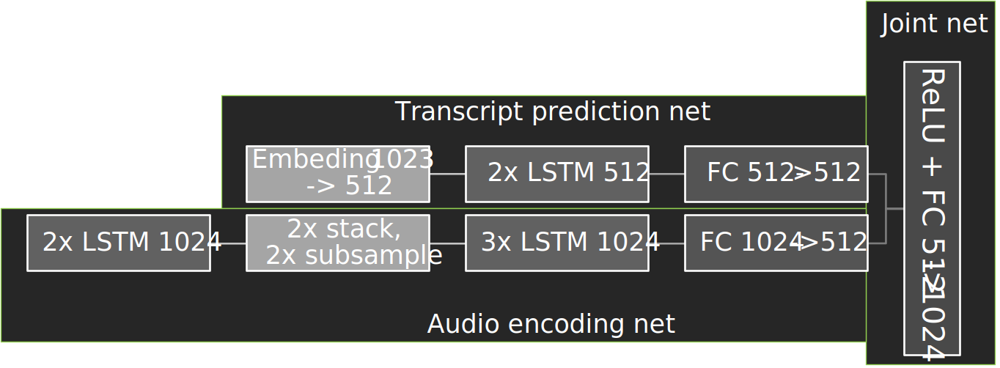

# 1. Problem 
Speech recognition accepts raw audio samples and produces a corresponding text transcription.

# 2. Directions

## Steps to configure machine
### From Docker
1. Clone the repository
```
git clone https://github.com/mlcommon/training.git
```
2. Install CUDA and Docker
```
source training/install_cuda_docker.sh
```
3. Build the docker image for the single stage detection task
```
# Build from Dockerfile
cd training/rnn_speech_recognition/pytorch/
bash scripts/docker/build.sh
```

#### Requirements
Currently, the reference uses CUDA-11.0 (see [Dockerfile](Dockerfile#L15)).
Here you can find a table listing compatible drivers: https://docs.nvidia.com/deploy/cuda-compatibility/index.html#binary-compatibility__table-toolkit-driver

## Steps to download data
1. Start an interactive session in the NGC container to run data download/training/inference
```
bash scripts/docker/launch.sh <DATA_DIR> <CHECKPOINT_DIR> <RESULTS_DIR>
```

Within the container, the contents of this repository will be copied to the `/workspace/rnnt` directory. The `/datasets`, `/checkpoints`, `/results` directories are mounted as volumes
and mapped to the corresponding directories `<DATA_DIR>`, `<CHECKPOINT_DIR>`, `<RESULT_DIR>` on the host.

2. Download and preprocess the dataset.

No GPU is required for data download and preprocessing. Therefore, if GPU usage is a limited resource, launch the container for this section on a CPU machine by following prevoius steps.

Note: Downloading and preprocessing the dataset requires 500GB of free disk space and can take several hours to complete.

This repository provides scripts to download, and extract the following datasets:

* LibriSpeech [http://www.openslr.org/12](http://www.openslr.org/12)

LibriSpeech contains 1000 hours of 16kHz read English speech derived from public domain audiobooks from LibriVox project and has been carefully segmented and aligned. For more information, see the [LIBRISPEECH: AN ASR CORPUS BASED ON PUBLIC DOMAIN AUDIO BOOKS](http://www.danielpovey.com/files/2015_icassp_librispeech.pdf) paper.

Inside the container, download and extract the datasets into the required format for later training and inference:
```bash
bash scripts/download_librispeech.sh
```
Once the data download is complete, the following folders should exist:

* `/datasets/LibriSpeech/`
   * `train-clean-100/`
   * `train-clean-360/`
   * `train-other-500/`
   * `dev-clean/`
   * `dev-other/`
   * `test-clean/`
   * `test-other/`

Since `/datasets/` is mounted to `<DATA_DIR>` on the host (see Step 3),  once the dataset is downloaded it will be accessible from outside of the container at `<DATA_DIR>/LibriSpeech`.

Next, convert the data into WAV files:
```bash
bash scripts/preprocess_librispeech.sh
```
Once the data is converted, the following additional files and folders should exist:
* `datasets/LibriSpeech/`
   * `librispeech-train-clean-100-wav.json`
   * `librispeech-train-clean-360-wav.json`
   * `librispeech-train-other-500-wav.json`
   * `librispeech-dev-clean-wav.json`
   * `librispeech-dev-other-wav.json`
   * `librispeech-test-clean-wav.json`
   * `librispeech-test-other-wav.json`
   * `train-clean-100-wav/`
   * `train-clean-360-wav/`
   * `train-other-500-wav/`
   * `dev-clean-wav/`
   * `dev-other-wav/`
   * `test-clean-wav/`
   * `test-other-wav/`

For training, the following manifest files are used:
   * `librispeech-train-clean-100-wav.json`
   * `librispeech-train-clean-360-wav.json`
   * `librispeech-train-other-500-wav.json`

For evaluation, the `librispeech-dev-clean-wav.json` is used.

## Steps to run benchmark.

### Steps to launch training

Inside the container, use the following script to start training.
Make sure the downloaded and preprocessed dataset is located at `<DATA_DIR>/LibriSpeech` on the host (see Step 3), which corresponds to `/datasets/LibriSpeech` inside the container.

```bash
bash scripts/train.sh
```

This script tries to use 8 GPUs by default.
To run 1-gpu training, use the following command:

```bash
NUM_GPUS=1 GRAD_ACCUMULATION_STEPS=64 scripts/train.sh
```

# 3. Dataset/Environment
### Publication/Attribution
["OpenSLR LibriSpeech Corpus"](http://www.openslr.org/12/) provides over 1000 hours of speech data in the form of raw audio.

### Data preprocessing
Data preprocessing is described by scripts mentioned in the [Steps to download data](#steps-to-download-data).

### Data pipeline
Transcripts are encoded to sentencepieces using model produced in [Steps to download data](#steps-to-download-data).
Audio processing consists of the following steps:
1. audio is decoded with sample rate choosen uniformly between 13800 and 18400 ([code](./common/data/dali/pipeline.py#L91-L97));
2. silience is trimmed with -60 dB threshold (datails in the [DALI documentation](https://docs.nvidia.com/deeplearning/dali/archives/dali_0280/user-guide/docs/supported_ops.html?highlight=nonsilentregion#nvidia.dali.ops.NonsilentRegion)) ([code](./common/data/dali/pipeline.py#L120-L121));
3. random noise with normal distribution and 0.00001 amplitude is applied to reduce quantization effect (dither) ([code](/common/data/dali/pipeline.py#L197));
4. Pre-emphasis filter is applied (details in the [DALI documentation](https://docs.nvidia.com/deeplearning/dali/archives/dali_0280/user-guide/docs/supported_ops.html?highlight=nonsilentregion#nvidia.dali.ops.PreemphasisFilter) ([code](./common/data/dali/pipeline.py#L101));
1. spectograms are calculated with 512 ffts, 20ms window and 10ms stride ([code](./common/data/dali/pipeline.py#L103-L105));
1. MelFilterBanks are calculated with 80 features and normalization ([code](./common/data/dali/pipeline.py#L107-L108));
1. features are translated to decibeles with log(10) multiplier reference magnitude 1 and 1e-20 cutoff (details in the [DALI documentation](https://docs.nvidia.com/deeplearning/dali/archives/dali_0280/user-guide/docs/supported_ops.html?highlight=nonsilentregion#nvidia.dali.ops.ToDecibels)) ([code](./common/data/dali/pipeline.py#L110-L111));
1. features are normalized along time dimension using algorithm described in the [normalize operator documentation](https://docs.nvidia.com/deeplearning/dali/user-guide/docs/examples/general/normalize.html) ([code](common/data/dali/pipeline.py#L115));
1. In the train pipeline, an adaptive specaugment augmentation is applied ([arxiv](https://arxiv.org/abs/1912.05533), [code](https://github.com/mwawrzos/training/blob/rnnt/rnn_speech_recognition/pytorch/common/data/features.py#L44-L117)). In the evaluation pipeline, this step is omitted;
1. to reduce accelerator memory usage, frames are spliced (stacked three times, and subsampled three times) ([code](https://github.com/mwawrzos/training/blob/rnnt/rnn_speech_recognition/pytorch/common/data/features.py#L144-L165));

### Training and test data separation
Dataset authors separated it to test and training subsets. For this benchmark, training is done on train-clean-100, train-clean-360 and train-other-500 subsets. Evaluation is done on dev-clean subset.

### Training data order
To reduce data padding in minibatches, data bucketing is applied.
The algorithm is implemented here:
[link](https://github.com/mlcommons/training/blob/2126999a1ffff542064bb3208650a1e673920dcf/rnn_speech_recognition/pytorch/common/data/dali/sampler.py#L65-L105)
and can be described as follows:
1. drop samples longer than a given threshold ([code](./common/data/dali/data_loader.py#L97-L98));
1. sort data by audio length ([code](./common/data/dali/sampler.py#L69));
2. split data into 6 equally sized buckets ([code](./common/data/dali/sampler.py#L70));
3. for every epochs:
    1. shuffle data in each bucket ([code](common/data/dali/sampler.py#L73-L78));
    2. as long as all samples are not divisible by global batch size, remove random element from random bucket ([code](./common/data/dali/sampler.py#L82-L86));
    3. concatenate all buckets;
    4. split samples into minibatches ([code](./common/data/dali/sampler.py#L90));
    5. shuffle minibatches in the epoch ([code](./common/data/dali/sampler.py#L93-L94)).

### Test data order
Test data order is the same as in the dataset.

# 4. Model
### Publication/Attribution
To the best of our knowledge, there is no single publication describing RNN-T training on LibriSpeech,
or another publicly available dataset of reasonable size. For that reason, the reference will be a
collection of solutions from several works. It is based on the following articles:
* Graves 2012 - an invention of RNN-Transducer: https://arxiv.org/abs/1211.3711
* Rao 2018 - time reduction in the acoustic model, internal dataset: https://arxiv.org/abs/1801.00841
* Zhang 2020 - Transformer-transducer publication. It includes bi-directional LSTM RNN-T result on LibriSpeech: https://arxiv.org/abs/2002.02562
* Park 2019 - adaptive spec augment, internal dataset: https://arxiv.org/abs/1912.05533
* Guo 2020 - RNN-T trained with vanilla LSTM, internal dataset: https://arxiv.org/abs/2007.13802

### List of layers 
Model structure is described in the following picture:


### Weight and bias initialization
* In all fully connected layers, weights and biases are initialized as defined in the [Pytorch 1.7.0 torch.nn.Linear documentation](https://pytorch.org/docs/1.7.0/generated/torch.nn.Linear.html#torch.nn.Linear) ([code](./rnnt/model.py#L123-L137)).
* In the embeding layer, weights are initialized as defined in the [Pytorch 1.7.0 torch.nn.Embeding documentation](https://pytorch.org/docs/1.7.0/generated/torch.nn.Embedding.html#torch.nn.Embedding) ([code](./rnnt/model.py#L105)).
* In all LSTM layers:
    * weights and biases are initialized as defined in the [Pytorch 1.7.0 torch.nn.LSTM documentation](https://pytorch.org/docs/1.7.0/generated/torch.nn.LSTM.html#torch.nn.LSTM) ([code](./common/rnn.py#L56-L61)),
    * forget gate biases are set to 1 ([code](./common/rnn.py#L67-L69)),
    * then the weights and bias values are divided by two (in result, the forget gate biases are set to 0.5) ([code](./common/rnn.py#L74-L76)).

### Loss function
Transducer Loss 
### Optimizer
RNN-T benchmark uses LAMB optimizer. More details are in [training policies](https://github.com/mlcommons/training_policies/blob/master/training_rules.adoc#appendix-allowed-optimizers).

To decrease the number of epochs needed to reach the target accuracy,
evaluation is done with an exponential moving average of the trained model weights with a smoothing factor set to 0.999.

# 5. Quality
### Quality metric
Word Error Rate (WER) across all words in the output text of all samples in the validation set.
### Quality target
Target quality is 0.058 Word Error Rate or lower.
### Evaluation frequency
Evaluation is done after each training epoch.
### Evaluation thoroughness
Evaluation is done on each sample from the evaluation set.
